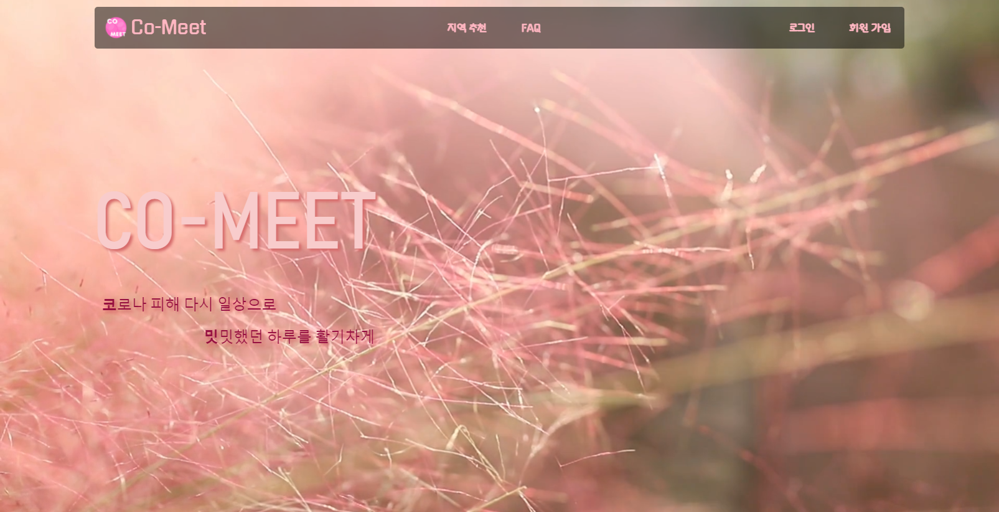
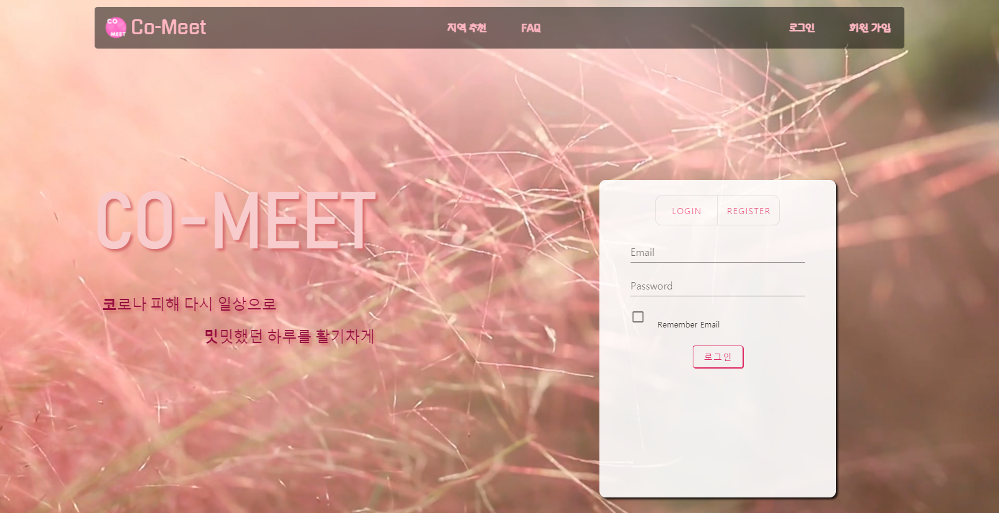
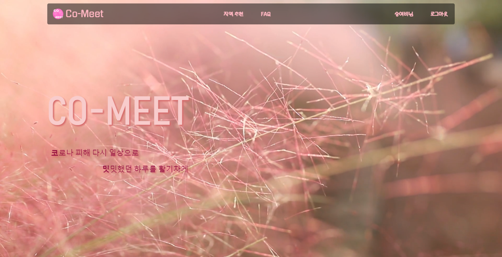
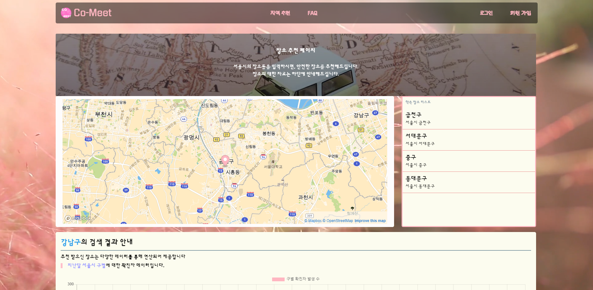
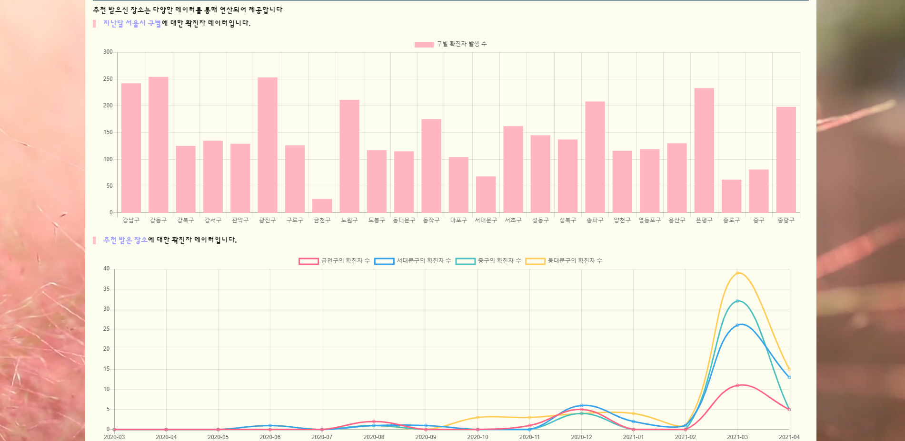
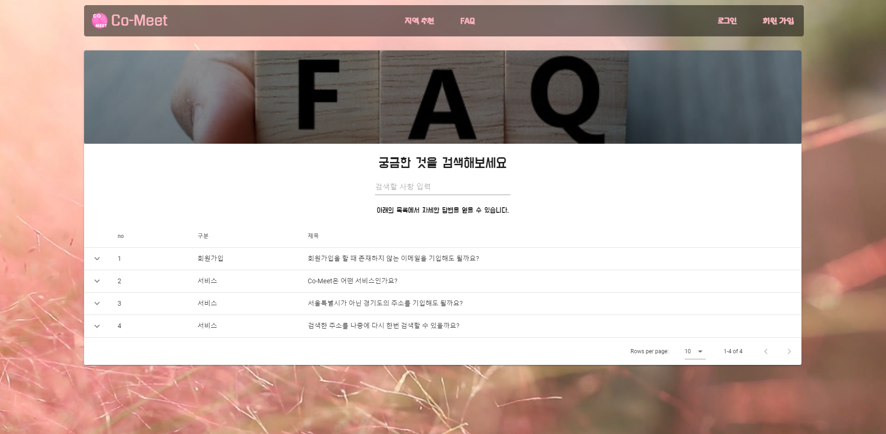

## Page

## Page Description

-   Vue.cli의 SPA 특성상 크게 두 개의 view가 존재합니다.

    > 웹의 느낌을 줄이고, 실제 소프트웨어의 느낌을 살리기 위해 에니메이션 효과를 사용했습니다.

    -   랜딩 페이지

        -   서비스의 첫 이미지를 담당하기 때문에 시각적인 효과에 집중할 수 있도록 개발하였습니다.
        -   봄의 만연한 꽃과 코로나 종식을 기원하는 마음을 담은 배경 화사한 느낌의 배경을 선택했습니다.
        -   프로젝트의 주된 색상 또한 이 배경에서 차용했습니다.

    -   메인 기능을 하는 장소 추천 페이지

        -   실제 장소 추천 기능을 하는 페이지입니다.
        -   최대한 직관적인 느낌과 글을 사용하지 않아도 사용할 수 있게 스타일링하려고 노력했습니다.
